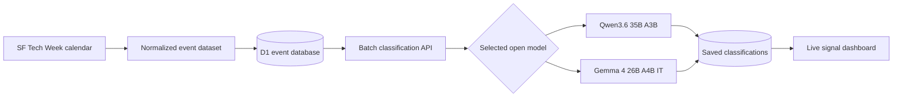

# SF Tech Week Signal
**A live event-intelligence dashboard for deciding which SF Tech Week events are actually worth your calendar.**
[Open the live dashboard](https://sf-tech-week-signal-2026.ji-richelle.chatgpt.site) · [Browse the SF Tech Week calendar](https://www.tech-week.com/calendar/sf)
SF Tech Week Signal collects the October 5–11, 2026 event calendar, retains event descriptions, and uses an open-model classifier to score every event for founders, engineers, researchers, and job seekers. It makes the tradeoff visible: useful people and access on one side, sponsor-heavy noise on the other.
> This is an independent community project and is not affiliated with or endorsed by SF Tech Week.
## What it does
- Stores **1,697 SF Tech Week events** with date, time, host, location, source URL, status, and description.
- Classifies events with either `Qwen/Qwen3.6-35B-A3B` or `google/gemma-4-26B-A4B-it`.
- Streams processed events into the dashboard as each batch finishes.
- Shows live progress, input/output token volume, current model activity, and signal mix.
- Produces a `GO`, `MAYBE`, or `SKIP` verdict and a 0–100 **vibe** score.
- Builds persona-specific shortlists for founders raising, job seekers, engineers, and researchers.
- Persists runs and results so classifications survive a refresh and can be queried later.
## Classification rubric
The dashboard exposes adjustable weights for each run.
| Criterion | What counts as signal |
| --- | --- |
| Investor access | Partners, principals, angels, allocators, credible fundraising intent, and small-group access |
| Engineer talent | Strong engineers, technical leaders, maintainers, builders, and formats that reveal real ability |
| Research talent | Researchers, paper authors, labs, frontier-model teams, and substantive scientific depth |
| Looking for a job | Recruiters, hiring managers, open roles, referral access, and career-relevant conversations |
| Food quality | Substantial food that supports the event format—not snack-table bait |
| Exclusivity | Relevant invitees, limited capacity, meaningful curation, and credible access barriers |
| Swag ROI | Useful, high-quality giveaways relative to the time and attention demanded |
| Venue quality | Comfort, acoustics, accessibility, location, layout, and suitability for conversation |
| Sales pitch / noise | Sponsor-heavy framing, vague futurism, lead generation, and low audience specificity |
The classifier chooses one primary audience signal per event, generates a vibe score, and maps that score to a verdict:
- `GO`: vibe ≥ 78
- `MAYBE`: vibe 62–77
- `SKIP`: vibe < 62
## How it works

The browser starts a classification run and requests batches of up to 10 events. The server sends structured event context and rubric weights to the classifier endpoint, normalizes the response, persists the result, and returns telemetry to the interface. The API key never reaches the browser.
## Stack
- Vanilla HTML, CSS, and JavaScript
- Python build script for normalized JSON, browser assets, SQLite, and D1 migrations
- Cloudflare Worker-compatible server runtime
- Cloudflare D1 for events, runs, and classifications
- ChatGPT Sites for hosting and managed server-side secrets
- Open models served through [Featherless.ai](https://featherless.ai)
## Repository layout
```text
.
├── data/                         # Normalized source event dataset
├── dist/
│   ├── client/                   # Deployable browser assets
│   ├── server/                   # Worker API and runtime configuration
│   └── data/                     # Generated JSON, JS, and SQLite exports
├── drizzle/                      # D1 schema and seed migrations
├── scripts/build_event_assets.py # Rebuilds all derived event assets
├── .env.example                  # Safe environment-variable template
└── .openai/hosting.json          # Sites project and D1 binding metadata
```
## Local setup
### 1. Clone and configure
```bash
git clone https://github.com/RichelleJi/sf-tech-week-signal.git
cd sf-tech-week-signal
cp .env.example .env
```
Add your server-side classifier credentials to `.env`:
```dotenv
CLASSIFIER_ENDPOINT=https://your-classifier.example/v1/systemone
CLASSIFIER_API_KEY=replace-with-your-key
```
`.env` is ignored by Git. Never add a real API key to `.env.example` or client-side JavaScript.
### 2. Rebuild the event assets
Python 3 includes everything the build script needs:
```bash
python3 scripts/build_event_assets.py
```
This validates all 1,697 unique records and regenerates the browser dataset, portable SQLite database, and D1 migration.
### 3. Preview the interface
For a static UI preview:
```bash
python3 -m http.server 4173 --directory dist/client
```
Then open `http://localhost:4173`. Static previewing shows the interface and bundled event data; live classification requires the Worker API, D1 binding, and server-side secrets.
### 4. Run the full stack
Use Wrangler or a compatible Worker runtime with:
- Worker entry point: `dist/server/index.js`
- Worker configuration: `dist/server/wrangler.json`
- D1 binding name: `DB`
- Migrations: `drizzle/0000_events.sql`, then `drizzle/0001_classifications.sql`
- Secrets: `CLASSIFIER_ENDPOINT` and `CLASSIFIER_API_KEY`
## API
| Method | Route | Purpose |
| --- | --- | --- |
| `GET` | `/api/events` | Paginated events; accepts `limit`, `offset`, and optional `date` |
| `GET` | `/api/stats` | Event totals by date and description status |
| `GET` | `/api/classifications?model=…` | Saved results and latest run for a supported model |
| `POST` | `/api/classify/start` | Creates a run and clears stale results for that model |
| `POST` | `/api/classify/batch` | Classifies and persists the next event batch |
Supported model identifiers:
```text
Qwen/Qwen3.6-35B-A3B
google/gemma-4-26B-A4B-it
```
## Data model
The D1 database contains three tables:
- `events`: normalized scraped event records and retained descriptions
- `classification_runs`: model, progress, token totals, total latency, timestamps, and errors
- `event_classifications`: per-model signal, audience, vibe, verdict, confidence, tokens, and latency
The generated `dist/data/events.sqlite` export makes the event table available without the hosted backend.
## Privacy and security
- Classifier credentials are server-side only.
- `.env` is intentionally ignored; `.env.example` contains placeholders.
- The repository does not contain the production classifier key.
- Event descriptions and links come from public event listings and remain attributable to their sources.
## Contributing
Issues and pull requests are welcome. Useful contributions include rubric improvements, accessibility fixes, visualization refinements, model evaluation, and better handling of incomplete event descriptions.
When changing the event dataset, run `python3 scripts/build_event_assets.py` before committing so all generated formats stay synchronized.
---
Built to answer one question: **is this event signal, or just another rooftop mixer with a logo wall?**
